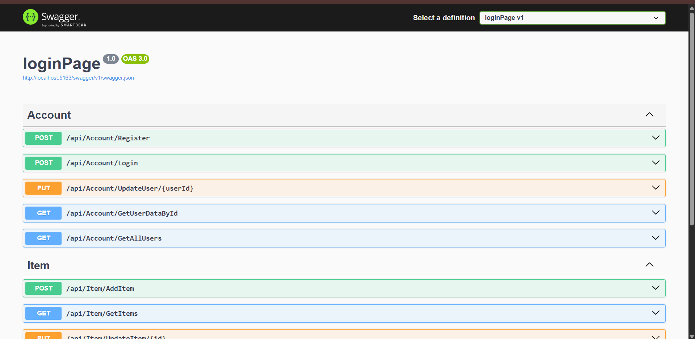
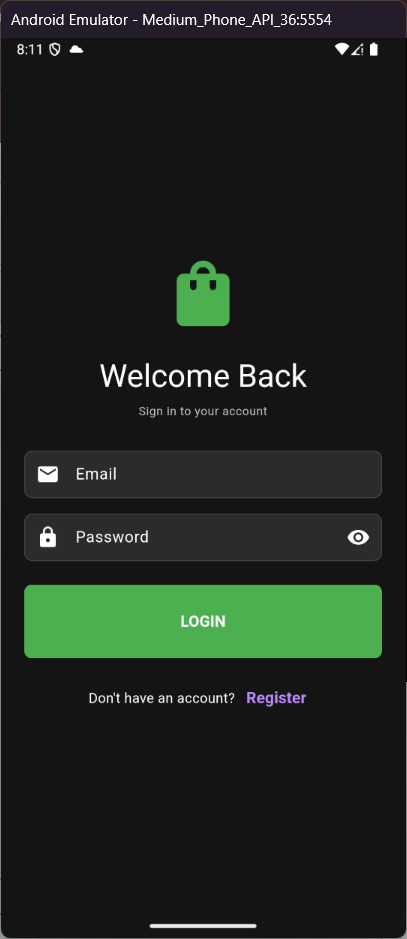
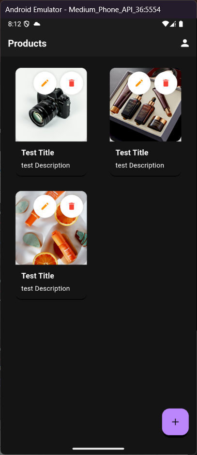
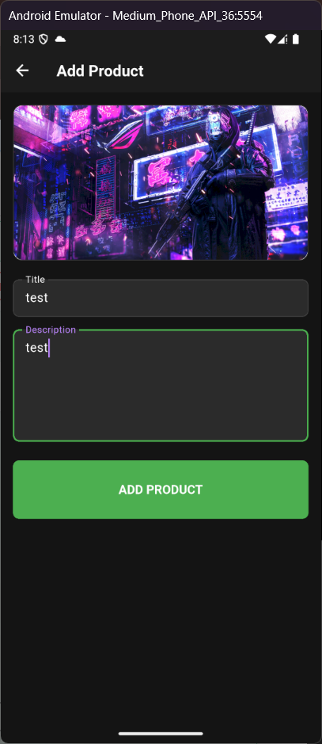
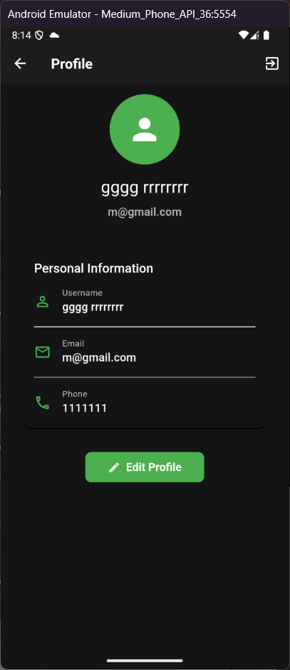
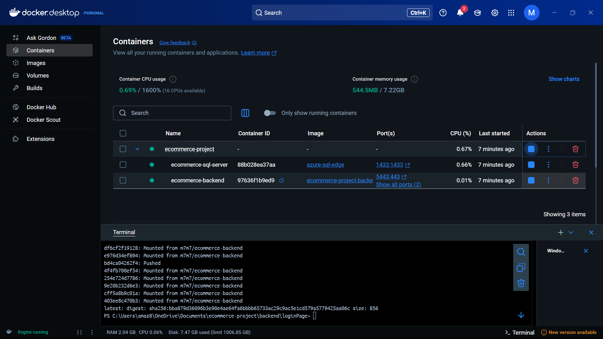

# E-commerce Platform with .NET and Flutter

<div align="center">
  
  <p><em>A containerized e-commerce platform built with modern technologies and orchestrated using Docker</em></p>
</div>

---

## Project Overview

This e-commerce platform enables users to register, login, manage products, and update their profiles. It follows a clean architecture approach with separate layers for presentation, business logic, and data access.

### Key Features

- **User Authentication**: Register, login, and manage user profiles  
- **Product Management**: Add, update, view, and delete products  
- **Image Handling**: Upload and store product images  
- **Responsive UI**: Works across web and mobile platforms  

---

## Tech Stack

### Backend
- **Framework**: ASP.NET Core 8.0  
- **Database**: SQL Server  
- **ORM**: Entity Framework Core  
- **Authentication**: JWT (JSON Web Tokens)  

### Frontend
- **Framework**: Flutter  
- **State Management**: BLoC Pattern  
- **HTTP Client**: Dio  
- **Image Handling**: Multi-platform support (Web, Android, iOS)  

### DevOps
- **Containerization**: Docker  
- **Orchestration**: Docker Compose  
- **Version Control**: Git  

---

## Architecture

### Backend (.NET)
1. **Controller Layer**: API endpoints for authentication and product operations  
2. **Model Layer**: Domain entities and DTOs  
3. **Data Layer**: Repository pattern with Entity Framework Core  

### Frontend (Flutter)
1. **Presentation Layer**: UI components and screens  
2. **Business Logic Layer**: BLoC for state management  
3. **Data Layer**: Repositories and remote data sources  

---

## Getting Started

### Prerequisites
- Docker and Docker Compose installed  
- Git (for cloning the repository)  

### Running with Docker Compose

1. **Clone the repository**  
   ```bash
   git clone https://github.com/mohamed12344556/E-Commerce-App-With-Docker.git
   cd ecommerce-project
   ```

2. **Back-end: Apply EF Core Migrations**  
   ```bash
   cd backend/loginPage
   dotnet ef migrations add InitialCreate
   dotnet ef database update
   ```

3. **Troubleshooting Database Connection**  
   ```bash
   docker ps | grep sql-server
   docker logs ecommerce-sql-server
   # تأكد من إعداد سلسلة الاتصال
   ConnectionStrings__conStr="Server=sql-server;Database=Ecommerce;User Id=sa;Password=YourStrongPassword123!;TrustServerCertificate=true;"
   docker-compose restart backend
   ```

4. **تشغيل التطبيق**  
   ```bash
   docker-compose up --build
   ```
5. **الوصول إلى الواجهة**  
   - Backend API: `http://localhost:5163`

---

## Docker Images

- **Backend**: [DockerHub Link](https://hub.docker.com/yourusername/ecommerce-backend)

---

## Screenshots

| Feature                       | Screenshot                                                | Description                                            |
|-------------------------------|-----------------------------------------------------------|--------------------------------------------------------|
| **Backend API (Swagger UI)**  |             | عرض جميع نقاط النهاية في Swagger UI                    |
| **Login Screen**              |                     | واجهة تسجيل الدخول مع التحقق من صحة البيانات           |
| **Products List**             |            | عرض شبكة المنتجات مع صورها وتفاصيلها                   |
| **Add Product**               |                | نموذج لإضافة منتج جديد مع رفع الصورة                   |
| **User Profile**              |                   | واجهة إدارة الملف الشخصي للمستخدم                     |
| **Docker Containers**         |          | شاشة Docker Desktop بعد تشغيل الحاويات                 |

---

## API Endpoints

### Authentication
| Method | Endpoint                             | Description               |
|:------:|--------------------------------------|---------------------------|
| POST   | `/api/Account/Register`              | Register a new user       |
| POST   | `/api/Account/Login`                 | User login                |
| PUT    | `/api/Account/UpdateUser/{userId}`   | Update user profile       |
| GET    | `/api/Account/GetUserDataById`       | Get user data by ID       |
| GET    | `/api/Account/GetAllUsers`           | Get all users             |

### Products
| Method | Endpoint                            | Description          |
|:------:|-------------------------------------|----------------------|
| GET    | `/api/Item/GetItems`                | Get all products     |
| POST   | `/api/Item/AddItem`                 | Add a new product    |
| PUT    | `/api/Item/UpdateItem/{id}`         | Update a product     |
| DELETE | `/api/Item/DeleteItem/{id}`         | Delete a product     |

---

## Docker Configuration

### Backend Dockerfile
```dockerfile
FROM mcr.microsoft.com/dotnet/aspnet:8.0 AS base
WORKDIR /app
EXPOSE 80 443

FROM mcr.microsoft.com/dotnet/sdk:8.0 AS build
WORKDIR /src
COPY ["loginPage.csproj", "./"]
RUN dotnet restore "loginPage.csproj"
COPY . .
RUN dotnet build "loginPage.csproj" -c Release -o /app/build

FROM build AS publish
RUN dotnet publish "loginPage.csproj" -c Release -o /app/publish /p:UseAppHost=false

FROM base AS final
WORKDIR /app
COPY --from=publish /app/publish .

COPY entrypoint.sh .
RUN chmod +x entrypoint.sh
ENTRYPOINT ["./entrypoint.sh"]
```

### docker-compose.yml
```yaml
version: '3.8'

services:
  sql-server:
    image: mcr.microsoft.com/azure-sql-edge
    container_name: ecommerce-sql-server
    environment:
      - ACCEPT_EULA=Y
      - SA_PASSWORD=YourStrongPassword123!
    ports:
      - "1433:1433"
    volumes:
      - sql-data:/var/opt/mssql
    networks:
      - ecommerce-network
    command: /opt/mssql/bin/sqlservr

  backend:
    build:
      context: ./backend/loginPage
      dockerfile: Dockerfile
    container_name: ecommerce-backend
    ports:
      - "5163:80"
      - "5443:443"
    environment:
      - ASPNETCORE_ENVIRONMENT=Development
      - ASPNETCORE_URLS=http://+:80
      - ConnectionStrings__conStr=Server=sql-server;Database=Ecommerce;User Id=sa;Password=YourStrongPassword123!;TrustServerCertificate=true;
      - JWT__Issuer=http://localhost:5163
      - JWT__Audience=http://localhost:8080
    depends_on:
      - sql-server
    networks:
      - ecommerce-network
    restart: on-failure:3

networks:
  ecommerce-network:
    driver: bridge

volumes:
  sql-data:
    name: ecommerce-db-data
```

## Contributors
- Mohamed Ahmed Mohamed Abdelkawy  
- Mariam Mohamed Moawad Abdelaziz  
- Asmaa Elsayed Mohamed Ahmed  
- Haneen Mahmoud Sayed Nabawy  
- Saeed Sayed Salah  

---

## License
This project is licensed under the MIT License – see the `LICENSE` file for details.
